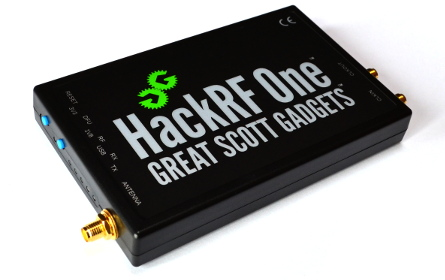

# HackRF_FM

<h1>FM_Modulation</h1>
Frequency modulation, commonly referred to as FM, is a common term that we hear in our daily lives. Today, Frequency modulation is used widely in radio communication and broadcasting
Frequency modulation is a technique or a process of encoding information on a particular signal (analogue or digital) by varying the carrier wave frequency in accordance with the frequency of the modulating signal. As we know, a modulating signal is nothing but information or message that has to be transmitted after being converted into an electronic signal.

<h1>HackRF</h1>
HackRF One from Great Scott Gadgets is a Software Defined Radio peripheral capable of transmission or reception of radio signals from 1 MHz to 6 GHz. Designed to enable test and development of modern and next generation radio technologies, HackRF One is an open source hardware platform that can be used as a USB peripheral 

<h1>Block Used</h1>

**blocks wavfile source block**

Read stream from a Microsoft PCM (.wav) file, output floats.
Unless otherwise called, values are within [-1;1]

**WBFM Transmit block**

Wide Band FM Transmitter.

Takes a single float input stream of audio samples in the range [-1,+1] and produces a single FM modulated complex baseband output.

The only difference with NBFM Transmit is the size of the internal low pass filter for interpolation. Here it has a cutoff frequency of 16kHz with 2KHz of transition width.

**rational resampling block**

This is a rational resampling polyphase FIR filter.
Either taps or fractional_bw may be specified, but not both.
If neither is specified, a reasonable default, 0.4, is used as the fractional_bw.

**QT GUI freq sink block**

A graphical sink to display multiple signals in frequency.
This is a QT-based graphical sink the takes set of a complex streams and plots the PSD. Each signal is plotted with a different color, and the  and  functions can be used to change the label and color for a given input number.

**OSMOSDR SINK block**

this block used to transfer the outputsignal after resampling to the hackrf module throudh a USB data cable.

<h1>Flowgraph</h1>

!(flowgraph)[]
